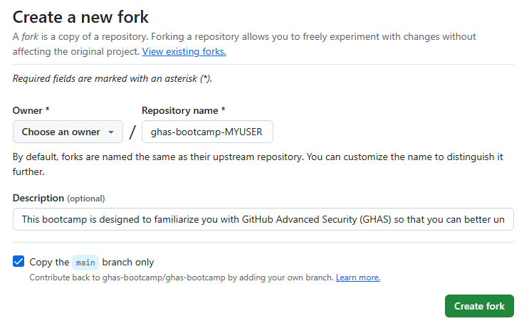
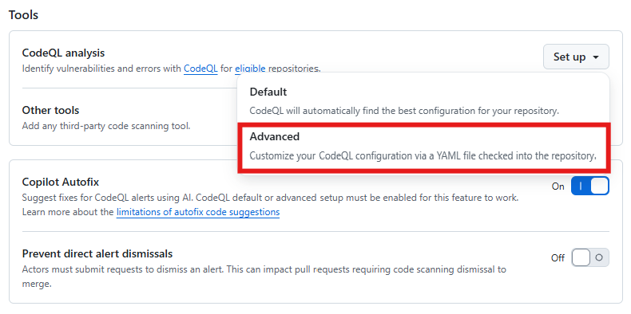

# 3.CodeQL-AdvancedMode

This folder contains advanced exercises and materials for using CodeQL beyond the basics, with a focus on hands-on experimentation in a real-world, multi-language codebase.

## Overview

These exercises are designed for users who are already familiar with CodeQL fundamentals and want to deepen their understanding or explore advanced features, including custom queries, workflow tuning, and multi-language analysis.

## Topics Covered
- Writing and running custom CodeQL queries and packs
- Using and extending CodeQL libraries
- Query suite configuration and filtering
- Multi-language and polyglot scanning
- Advanced CodeQL CLI usage and database exploration
- Custom build steps for complex projects
- Using external/community query packs
- Path filtering and analysis scope
- Uploading and triaging results in GitHub Security tab
- SARIF output and integrations
- Scheduled, event-based, and manual analysis
- Baseline/delta analysis
- Query tuning and performance optimization

## Prerequisites
- Completion of the introductory CodeQL course or equivalent experience
- CodeQL CLI installed and configured
- Access to a sample or real codebase for analysis (e.g., the ghas-bootcamp repo)

> **Note:**
> These exercises are for educational and demo purposes only. Do not use on production code without proper review.

---

## Getting Started

1. Fork https://github.com/ghas-bootcamp/ghas-bootcamp into your Organization. Add a unique identifier (e.g., your GitHub handle) to avoid conflicts.
2. In your fork, go to Repository *Settings* > *Security* > *Code Security* and select the *Advanced* CodeQL Analysis Mode.
3. Open the `.github/workflows/codeql.yml` file in your forked repository.
4. Use the exercises and ideas below to experiment with advanced CodeQL features.





---

## Advanced CodeQL Workflow Features to Try (for This Codebase)

The following examples are tailored for the languages present in this codebase:
- **GitHub Actions**
- **Go**
- **Java / Kotlin**
- **JavaScript / TypeScript**
- **Python**

### 1. Custom Query Packs
- Write your own CodeQL queries and organize them in a custom query pack ([docs](https://codeql.github.com/docs/codeql-cli/publishing-and-using-codeql-packs/)).
- Reference your custom pack in the workflow:
  ```yaml
  with:
    packs: ./path/to/your-custom-pack
  ```

### 2. Query Suite Configuration
- Create a custom `.qls` (query suite) file to include/exclude queries by tag, severity, or path.
- Reference it in the workflow:
  ```yaml
  with:
    queries: ./path/to/custom.qls
  ```
- Example filter in `.qls`:
  ```qls
  - include: "*"
    where: severity = 'error' and tags contains 'security'
  ```

### 3. Multi-language Scanning
- Ensure the `matrix.include` in `codeql.yml` lists all languages in the repo:
  ```yaml
  matrix:
    include:
      - language: go
        build-mode: autobuild
      - language: java-kotlin
        build-mode: none
      - language: javascript-typescript
        build-mode: none
      - language: python
        build-mode: none
      - language: actions
        build-mode: none
  ```

### 4. Database Creation & Exploration
- Use advanced setup to generate a CodeQL database artifact:
  ```yaml
  - name: Upload CodeQL database
    uses: actions/upload-artifact@v4
    with:
      name: codeql-db
      path: ${{ runner.temp }}/codeql-database
  ```
- Download and explore the database locally with CodeQL CLI or the VS Code extension.

### 5. Custom Build Steps
- For complex projects, set `build-mode: manual` and add build steps (e.g., Maven, Gradle, npm):
  ```yaml
  - if: matrix.language == 'java-kotlin' && matrix.build-mode == 'manual'
    run: ./mvnw clean install
  - if: matrix.language == 'go' && matrix.build-mode == 'manual'
    run: go build ./...
  ```

### 6. Using External Query Packs
- Use community or third-party query packs:
  ```yaml
  with:
    packs: githubsecuritylab/codeql-js-queries@latest
  ```

### 7. Path Filtering & Analysis Scope
- Use `paths:` and `paths-ignore:` in the workflow to control which files/folders are analyzed:
  ```yaml
  on:
    push:
      paths:
        - 'frontend/**'
      paths-ignore:
        - 'docs/**'
  ```

### 8. Uploading Results to GitHub Security Tab
- By default, results are uploaded to the Security tab. You can also use the `upload` option in the analyze step for custom SARIF files.

### 9. SARIF Output
- The workflow generates SARIF output. Download and view it locally or integrate with other tools (e.g., VS Code, security dashboards).

### 10. Scheduled vs. Event-based Analysis
- Configure triggers for push, pull_request, schedule, or manual (workflow_dispatch):
  ```yaml
  on:
    push:
    pull_request:
    schedule:
      - cron: '0 2 * * 1'
    workflow_dispatch:
  ```

### 11. Baseline & Delta Analysis
- Use the baseline feature to compare results between branches/commits and identify new/removed alerts. See [CodeQL docs](https://docs.github.com/en/code-security/code-scanning/using-codeql-code-scanning-with-your-existing-ci-system/about-baseline-and-delta-analyses-with-codeql).

### 12. Query Tuning & Performance
- Profile queries, adjust timeouts, and optimize performance for large codebases:
  ```yaml
  with:
    ram: 8192
    threads: 4
    timeout: 3600
  ```
- Use the `--profile` flag with the CLI for query profiling.

---

## Instructions for the Lab

1. Open `.github/workflows/codeql.yml` in your forked `ghas-bootcamp` repository.
2. Try out one or more of the advanced features listed above by editing the workflow file.
3. Commit and push your changes to trigger the workflow.
4. Observe the results in the Actions and Security tabs, or download artifacts for local exploration.
5. Experiment and combine features to see CodeQL’s advanced capabilities in action.

> For more details, see the [CodeQL Advanced Setup documentation](https://docs.github.com/en/code-security/code-scanning/creating-an-advanced-setup-for-code-scanning).

