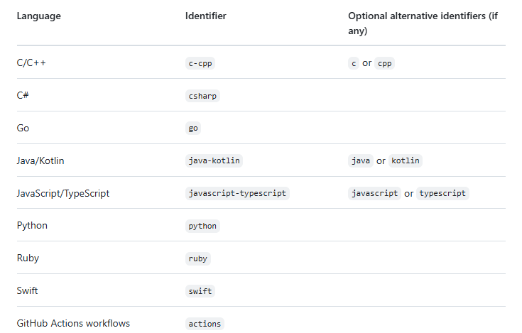

# 4.CodeQL-CLI

This folder contains hands-on exercises and documentation for using the CodeQL CLI.

## CodeQL CLI Hands-on Exercise Guidelines

### Prerequisites
- Git installed and configured
- CodeQL CLI installed (see Download & Install Guide below)
- Access to this repository
- A sample codebase to analyze (can be a simple JavaScript, Python, or Java project)

### Download & Install Guide

> **Reference:** These instructions are taken from the [official CodeQL CLI setup guide](https://docs.github.com/en/code-security/codeql-cli/getting-started-with-the-codeql-cli/setting-up-the-codeql-cli)

1. **Download the CodeQL CLI tar archive**

   - Download the CodeQL bundle from [https://github.com/github/codeql-action/releases](https://github.com/github/codeql-action/releases).
   - The bundle contains:
     - CodeQL CLI product
     - A compatible version of the queries and libraries from [https://github.com/github/codeql](https://github.com/github/codeql)
     - Precompiled versions of all the queries included in the bundle

   > You should always use the CodeQL bundle. This ensures compatibility and gives much better performance than a separate download of the CodeQL CLI and checkout of the CodeQL queries.

   

### Exercise Steps

1. **Clone the Repository**
   ```pwsh
   git clone https://github.com/org-contoso/webapp-ts
   cd webapp-ts
   ```
2. **Set Up the CodeQL Database**

    CodeQL databases are created by running the following command from the checkout root of your project:

    | Note: As part of this exercise, you must replace *database* and *language-identifier* by yourself. Choose any name for your database and choose the appropriate identifier for javascript.

   ```pwsh
   codeql database create <database> --language=<language-identifier>
   ```

   You must specify:

<database>: a path to the new database to be created. This directory will be created when you execute the command—you cannot specify an existing directory.

--language: the identifier for the language to create a database for. When used with --db-cluster, the option accepts a comma-separated list, or can be specified more than once. CodeQL supports creating databases for the following languages:



Note:
* If you specify one of the alternative identifiers, this is equivalent to using the standard language identifier. For example, specifying javascript instead of javascript-typescript will not exclude analysis of TypeScript code.
* If you want to add custom build commands, then you can do so by adding the `--command <build>` or use the `--build-mode: manual` in `advanced-codeql.yml`. This is recommended for Java, C/C++ or C#. For JS/TS, Python, Go By default, autobuild detection is used, which is what we 

3. **Run CodeQL Analysis**
   ```pwsh
   codeql database analyze my-database <optional-path-to-packs,queries> --format=sarif-latest --output=results.sarif
   ```


      Replace `<optional-path-to-packs,queries>` with the path to the CodeQL packs or queries you want to run (e.g., `codeql-repo/qlpacks/javascript-code-scanning.qls`). This is optional. To run the standard queries used for code scanning, omit this parameter. To see the other query suites included in the CodeQL CLI bundle, run `codeql resolve queries`. For this exercise, you can remove this parameter.

      Review the [full list of parameters](https://docs.github.com/en/code-security/codeql-cli/getting-started-with-the-codeql-cli/analyzing-your-code-with-codeql-queries#running-codeql-database-analyze) available with `codeql database analyze`.

      Note: The standard CodeQL packs for all supported languages are published in the [Container registry](https://github.com/orgs/codeql/packages). If you installed the CodeQL CLI in the standard way, using the CodeQL CLI bundle, the core query packs are already downloaded and available to you. They are:

      * codeql/cpp-queries
      * codeql/csharp-queries
      * codeql/go-queries
      * codeql/java-queries
      * codeql/javascript-queries
      * codeql/python-queries
      * codeql/ruby-queries
      * codeql/swift-queries


4. **Review Results**
   Open the `results.sarif` file in a compatible viewer or upload it to GitHub for visualization. For example, install the Sarif viewer extension on VS Code to view it in the VS Code editor.

   If you have enabled the `default setup` for CodeQL in the repo on github.com, compare the number of issues on the Repo's security overview and the Sarif viewer to see if you get the same number of issues using the default query suites.

5. **Clean Up (Optional)**
   ```pwsh
   Remove-Item -Recurse -Force my-database
   Remove-Item results.sarif
   ```


### References
- [CodeQL CLI Documentation](https://docs.github.com/en/code-security/codeql-cli/getting-started-with-the-codeql-cli/about-the-codeql-cli)
- [CodeQL Query Help](https://codeql.github.com/docs/)
